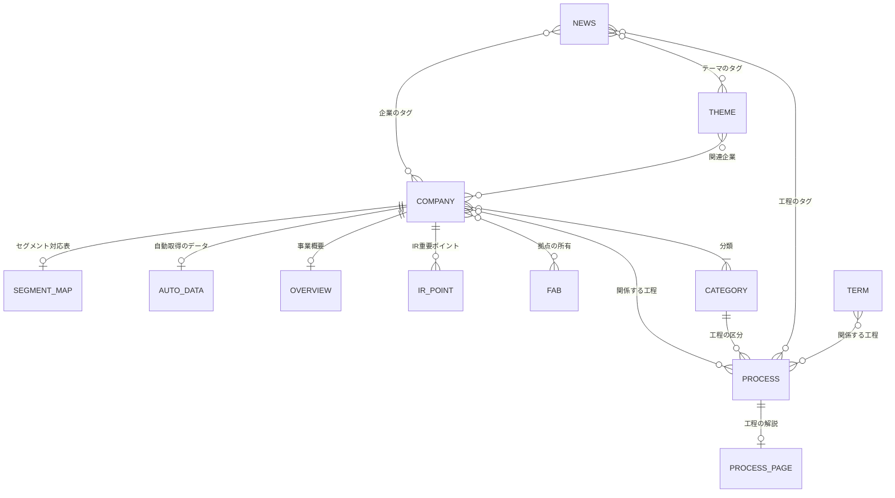

# SemiCompass データ定義書（第1段階）

| 項目 | 内容 |
| :--- | :--- |
| 版 | 第1.0版（案） |
| 作成日 | 2026年9月29日 |
| 改訂 | 2026年10月5日：デバイスの会社の`processes`（4.1）。2026年10月4日：前期の値の組替え・遡及修正の扱い（5.4、5.7）。取得できなかった値の書き方（5.2）。セグメントの名前の扱い（4.2、5.4）を決めた。XBRL対応（7.8）にDEIの対応を加えた。日付の検査（2.2）と、外資系日本法人の証券コード・EDINETコードの扱い（4.1）を明確にした。企業マスタの`selection.source`を、詳細掲載の企業だけ必須にした（4.1.2）。2026年10月2日：公開の番号をCloudflare Workersの版のIDに改めた（10.1）。2026年9月30日：原資料束（D30）の置き場所を、非公開の保管場所に改めた（8.1、15章）。よくある質問の書き方を加えた（6.9） |
| 基準とする文書 | アーキテクチャ設計書（第1段階）第1.0版、要件定義書（第1段階）第2.0版（関連文書：要求定義書 第2.0版、運用ルール書 第2.0版） |
| 対象の段階 | 第1段階（MVP、正式公開）。公開後の要求に使う項目は、予約の欄として定義だけを行う |
| 承認 | 未承認（要求定義書1.10の手順に従い、1日置いて読み直したうえで承認する） |

## 1. はじめに

### 1.1 本書の目的
要件定義書7章とアーキテクチャ設計書7章は、どのデータをどこに置き、誰が書くかを定めた。本書は、それを項目の単位まで具体にする。データごとに次を定める。

* 置き場所とファイルの名前の付け方
* 項目の名前、型、必須かどうか、値の範囲
* 他のデータへの参照（識別子）
* 形式の検証（P10）で確かめる規則

`schemas/`のJSON Schemaは、本書をもとに運営者が作る（アーキテクチャ設計書7.3、ADR-06）。

### 1.2 本書の位置づけ

| 文書 | 本書との関係 |
| :--- | :--- |
| 要件定義書（第2.0版） | 本書の上位の文書。データ要件（7章）の範囲を超えない |
| アーキテクチャ設計書（第1.0版） | 本書の上位の文書。データの持ち主と流れ（7.1）、識別子（7.2）に従う |
| 運用ルール書（第2.0版） | 設定ファイルに入れる数値の出典。本書は設定ファイルの構造だけを定める |
| `schemas/`（JSON Schema） | 本書の下位。本書と食い違う場合は、本書を正として`schemas/`を直す。`schemas/`の変更は運営者だけが行う（CLAUDE.md 2章） |
| CLAUDE.md | 本書の決まりのうち、Claudeが守るものを要約して載せる |

本書を作る中で見つけた上位の文書との食い違いは、14章に挙げる。

### 1.3 表の読み方
項目の表は、次の列で書く。

| 列 | 意味 |
| :--- | :--- |
| 項目 | ファイルの中のキーの名前 |
| 型 | 2.2の型。`list<T>`はTの並び、`ref<X>`はXの識別子 |
| 必須 | ◎：必須。○：条件付きで必須（条件は内容の列に書く）。−：任意。予：予約（公開後の要求のために定義だけを行い、表示に使わない） |
| 内容・制約 | 意味、値の範囲、書き方の決まり |

検証の規則は「不合格」（取り込めない）と「警告」（変更案に表示するが取り込める）を区別して書く。

## 2. 共通の決まり

### 2.1 ファイルの形式

| 項目 | 決まり |
| :--- | :--- |
| 文字コード | UTF-8（BOMなし）。改行はLF |
| YAML | YAML 1.2。日付は`"2026-09-29"`のように引用符で囲み、文字列として書く（自動で日付の型に変わることを防ぐ） |
| JSON | インデントは2文字。キーの順番は本書の表の順とする（差分を読みやすくするため） |
| Markdown | 先頭の項目（front matter）をYAMLで書き、その後に本文を書く |
| キーの名前 | 英小文字とアンダースコア（`fiscal_period_end`など） |
| 列挙の値 | 英小文字とアンダースコア。画面に出す日本語は`src/`の部品に持つ（DS-04） |
| 定義にないキー | 置かない。検証で不合格にする（CLAUDE.md 7章「形式に合わない項目を足さない」） |
| 形式の版 | `data/`と`config/`のファイルは、先頭に`schema_version`（整数）を持つ。項目の意味を変えるときに1つ上げる |

### 2.2 基本の型

| 型 | 書き方 | 例 |
| :--- | :--- | :--- |
| string | 1行の文字列。Markdownを使わない | `東京` |
| text | 複数行も可の文字列。Markdownを使わない | — |
| integer | 整数 | `3` |
| number | 数値。桁区切りのカンマを付けない | `1234.5` |
| boolean | `true`／`false` | `true` |
| date | `YYYY-MM-DD`（日本時間の日付）。実在する日付であること（`2026-13-45`は不合格）。検証では、`format: "date"`の検査を有効にする（Pythonの検証もAstroの検証も） | `"2026-09-29"` |
| datetime | ISO 8601、時差`+09:00`付き | `"2026-09-29T05:03:12+09:00"` |
| year_month | `YYYY-MM` | `"2026-03"` |
| url | `https://`で始まるURL。`http://`しかない資料は、出典（2.4.1）に限り認め、警告を出す | — |
| slug | `^[a-z0-9]+(-[a-z0-9]+)*$`、3〜60文字 | `sample-devices` |
| enum | 表に挙げた値だけを使う | `detailed` |
| source_id | `^S[0-9]+$`。1つのファイル（または原資料束）の中の資料の番号 | `S2` |
| doc_id | EDINETの書類管理番号。`^S100[0-9A-Z]{4}$` | `S100ABCD` |

### 2.3 識別子

| 対象 | 識別子 | 決め方 | 例 |
| :--- | :--- | :--- | :--- |
| 企業 | slug | 会社の英語表記をもとにする。「Co., Ltd.」「Corporation」などは入れない | `sample-devices` |
| 工程・プロダクトの分類 | slug | 4.3で固定する7つ | `front-end` |
| 工程 | slug | 4.3の一覧で固定する | `lithography` |
| 用語 | slug | 英語の名前か、よく使う略語をもとにする | `euv` |
| テーマ | slug | 英語の名前をもとにする | `power-semiconductors` |
| 国内拠点 | id | `{所有する企業のslug}-{地名}`。同じ組が既にあれば`-2`を付ける | `sample-devices-kumamoto` |
| ニュース | id | `{yyyy}-{mm}-{slug}`。年月は公開日の年月（アーキテクチャ設計書7.2） | `2026-10-sample-fab-start` |
| IR重要ポイント | id | `{企業のslug}/{決算期末の年月}-q{四半期}` | `sample-devices/2026-03-q2` |
| 提出書類 | doc_id | EDINETの書類管理番号をそのまま使う | `S100ABCD` |
| 資料（ファイルの中） | source_id | ファイル（原資料束）ごとにS1から振る | `S1` |
| 定期処理の実行 | run_id | GitHub Actionsの実行の番号 | `12345678901` |

識別子の決まり：

* 公開した識別子は変えない。社名や用語の表記が変わっても、識別子はそのままにする（FR-110）。
* 削除した識別子を、別の対象に使い回さない。
* 他のファイルを指すときは、必ず識別子で指す。名前の文字列で指さない（アーキテクチャ設計書7.2）。

### 2.4 共通の部品（何度も使う型）

#### 2.4.1 source（出典）

| 項目 | 型 | 必須 | 内容・制約 |
| :--- | :--- | :--- | :--- |
| id | source_id | ◎ | ファイルの中で重複しない |
| title | string | ◎ | 資料の名前（「2026年3月期 有価証券報告書」など） |
| publisher | string | ◎ | 発行元（企業は企業マスタの正式名称、官公庁は組織の名前） |
| url | url | ◎ | 資料の場所 |
| published_on | date | − | 資料の公表日 |
| accessed_on | date | ◎ | 運営者またはプログラムが確かめた日 |
| doc_id | doc_id | − | EDINETの書類なら書く |
| pages | string | − | 該当のページ（`"12"`、`"12-13"`） |

本文では、数値、日付、固有名詞の後に`[S2]`の形で出典の番号を付ける。サイトに表示するときは、部品が出典の一覧の形に変える（要件6.4）。

#### 2.4.2 amount（発表された金額）
国内拠点の投資額など、発表の値をそのまま持つ金額に使う（要件7.2）。

| 項目 | 型 | 必須 | 内容・制約 |
| :--- | :--- | :--- | :--- |
| value_mjpy | number | ○ | 百万円に換算した値。円建ての発表では必須。外貨建ての発表では書かない（為替で換算しない） |
| original_value | number | ◎ | 発表の数値 |
| original_unit | enum | ◎ | `yen`、`thousand_yen`、`million_yen`、`hundred_million_yen`（億円）、`trillion_yen`（兆円）、`million_usd`、`billion_usd`、`million_eur` |
| qualifier | enum | − | `about`（約）、`up_to`（最大）、`over`（超）。発表の表現に合わせる |
| as_of | date | ◎ | 発表の日 |
| source | source_id | ◎ | 同じファイルの`sources`の番号 |

#### 2.4.3 期間
決算の期間は、決算期末の年月と期間の種類で表す。

| 項目 | 型 | 内容 |
| :--- | :--- | :--- |
| fiscal_period_end | year_month | 決算期末の年月。2026年3月期なら`"2026-03"`。半期の値も、その半期を含む決算期の期末で表す |
| period_type | enum | `annual`（年次）、`half`（半期） |
| quarter | integer | 1〜4。IR重要ポイントと決算発表で使う。4は通期の決算発表 |

画面の表記（「2026年3月期」「2026年3月期第2四半期」）は、`src/lib/`の関数でこの3つから作る。表記の決まりはCLAUDE.md 5.1に従う。

#### 2.4.4 correction（訂正）

| 項目 | 型 | 必須 | 内容・制約 |
| :--- | :--- | :--- | :--- |
| date | date | ◎ | 訂正した日 |
| severity | enum | ◎ | `major`（重大）、`normal`（通常）。要求定義書6.10の区分 |
| description | text | ◎ | 何をどう直したか。200字以内。訂正一覧（`/corrections/`）にそのまま出す |
| issue | integer | − | 誤り報告のIssueの番号（サイトには出さない） |

`corrections`を持つファイルは、1件以上あれば訂正の表示と訂正一覧に自動で載る（CR-03）。

#### 2.4.5 company_history（企業の変更履歴）

| 項目 | 型 | 必須 | 内容・制約 |
| :--- | :--- | :--- | :--- |
| date | date | ◎ | 効力の発生した日 |
| type | enum | ◎ | `rename`（社名変更）、`merger`（統合）、`split`（分割）、`listing`（上場）、`delisting`（上場廃止）、`code_change`（証券コードの変更）、`other` |
| description | text | ◎ | 変更の内容。旧社名など |
| source | source_id | ◎ | 同じファイルの`sources`の番号 |

### 2.5 空欄と不明の扱い

| 書き方 | 意味 |
| :--- | :--- |
| 項目を書かない | 該当しない、または未設定 |
| `null` | 取得を試みたが値がなかった（`data/auto/`だけで使う） |
| `0` | 値が0であることを確かめた |
| 空のリスト`[]` | 該当するものがないことを確かめた（例：関係する工程がない用語） |

分からない値を推測で埋めない（CLAUDE.md 1章）。`0`と`null`を取り違えない。

### 2.6 文字数の数え方
文字数の上限と目安は、次の手順で数える。

1. 本文を見出しごとに分ける（見出しの行は数えない）。
2. Markdownの記法、出典の番号（`[S2]`）、改行、行頭と行末の空白を除く。
3. Unicodeの正規化（NFKC）の後の文字を、全角・半角を問わず1字と数える。

この数え方は、確認（P09）、AIの出力の検証（P05）、表示（P11）で同じ関数を使う。

## 3. データの全体像

### 3.1 データの一覧

| 番号 | データ | 置き場所 | 形式 | 書く人 | 形式の定義 | 段階 | 節 |
| :--- | :--- | :--- | :--- | :--- | :--- | :--- | :--- |
| D01 | 企業マスタ | `data/companies/{slug}.yaml` | YAML | 運営者・Claude | `schemas/data/company` | MVP | 4.1 |
| D02 | セグメント対応表 | `data/segments/{slug}.yaml` | YAML | 運営者・Claude | `schemas/data/segment-map` | MVP | 4.2 |
| D03 | 工程・プロダクトの分類 | `data/supply-chain.yaml` | YAML | 運営者・Claude | `schemas/data/supply-chain` | MVP | 4.3 |
| D04 | 国内拠点 | `data/fabs/{id}.yaml` | YAML | 運営者・Claude | `schemas/data/fab` | MVP（外資系日本法人）、正式公開 | 4.4 |
| D05 | 祝日 | `data/holidays.yaml` | YAML | 運営者・Claude | `schemas/data/holidays` | MVP | 4.5 |
| D06 | 自動取得のデータ | `data/auto/{slug}.json` | JSON | J01、J04 | `schemas/data/auto-company` | MVP | 5.1〜5.7 |
| D07 | 決算発表の予定 | `data/auto/earnings-schedule.json` | JSON | J04 | `schemas/data/earnings-schedule` | 正式公開 | 5.8 |
| D11 | ニュース | `content/news/` | Markdown | J03（AG-11）、Claude | `schemas/content/news` | MVP | 6.2 |
| D12 | IR重要ポイント | `content/ir-points/` | Markdown | J05（AG-12）、Claude | `schemas/content/ir-point` | MVP | 6.3 |
| D13 | 企業の事業概要 | `content/companies/` | Markdown | AG-14、Claude | `schemas/content/company-overview` | MVP | 6.4 |
| D14 | 工程 | `content/processes/` | Markdown | AG-14、Claude | `schemas/content/process` | MVP | 6.5 |
| D15 | 用語 | `content/glossary/` | Markdown | AG-14、Claude | `schemas/content/term` | MVP | 6.6 |
| D16 | テーマ | `content/themes/` | Markdown | AG-14、Claude | `schemas/content/theme` | 正式公開 | 6.7 |
| D17 | 学習 | `content/learn/` | Markdown、YAML | AG-14、Claude | `schemas/content/learn` | 正式公開 | 6.8 |
| D18 | 固定ページ | `content/pages/` | Markdown | 運営者・Claude | `schemas/content/page` | MVP | 6.9 |
| D19 | 論考 | `content/essays/` | Markdown | 運営者 | 第2段階で定める | 第2段階 | 6.10 |
| D20 | 設定 | `config/` | YAML | 運営者・Claude | `schemas/config/*` | MVP | 7章 |
| D30 | 原資料束 | 非公開の保管場所（90日） | JSON、JSON Lines | P04 | `schemas/bundle` | MVP | 8章 |
| D31 | エージェントの出力 | P05の中だけ（保存しない） | JSON | P05 | `schemas/agents/*` | MVP | 9章 |
| D32 | 事実確認の結果 | 変更案のコメント、`ops-log` | JSON | P08 | `schemas/factcheck` | MVP | 9.7 |
| D40 | 運営記録 | `ops-log`ブランチの`ops/` | JSON Lines、JSON、CSV | 定期処理 | `schemas/ops/*` | MVP | 10章 |
| D50 | 外部のサービスのデータ | フォーム、GA4 | — | 外部のサービス | — | MVP | 11章 |

`schemas/`のファイル名は、表の名前に`.schema.json`を付ける。

### 3.2 データの関係



中心は企業マスタである（要求定義書5.2）。他のデータは、企業のslug、工程のslugなどの識別子で企業マスタと工程の分類を指す。

## 4. マスタのデータ（`data/`）

### 4.1 企業マスタ（D01）
**置き場所**：`data/companies/{slug}.yaml`（1社1ファイル。ファイル名は`slug`と一致させる）

| 項目 | 型 | 必須 | 内容・制約 |
| :--- | :--- | :--- | :--- |
| schema_version | integer | ◎ | `1` |
| slug | slug | ◎ | URL（`/companies/{slug}/`）に使う。変えない |
| name | string | ◎ | 正式名称。「株式会社」などの法人の種類は省く（CLAUDE.md 5.1） |
| short_names | list<string> | ◎ | 略称。1件以上。1つ目を2回目以降の表示に使う |
| name_en | string | ◎ | 会社が使う英語表記 |
| name_kana | string | ◎ | 読み。全角カタカナ。法人の種類を含めない |
| search_aliases | list<string> | − | 旧社名、よく使われる別名。検索の候補（FR-701）にだけ使う |
| type | enum | ◎ | `domestic_listed`（国内上場）、`foreign_subsidiary`（外資系日本法人）、`conglomerate`（総合メーカー） |
| securities_code | string | ○ | `domestic_listed`と`conglomerate`は必須。`^[0-9][0-9A-Z]{3}$`（英字を含むコードに対応する） `foreign_subsidiary`は書かない（書くと不合格） |
| edinet_code | string | ○ | 同上。`^E[0-9]{5}$` `foreign_subsidiary`は書かない（書くと不合格） |
| categories | list<ref 分類> | ◎ | 工程・プロダクトの分類（4.3）。1件以上、重複なし |
| processes | list<ref 工程> | ○ | 関係する工程（4.3）。詳細掲載は、`categories`に`devices`を含まない会社は1件以上。**`categories`に`devices`を含む会社（デバイスを自社で作る会社）は、空`[]`でもよい**（運営者の判断、2026年10月5日。工程マスタ4.3は、装置・材料・検査・後工程・設計の会社を想定しており、デバイスの会社には当てはめにくいため）。空のとき、企業ページは、工程ではなく、分類と製品の説明で位置づける。企業一覧（FR-101）と工程ページの企業の一覧（FR-201）に使う |
| listing | enum | ◎ | `detailed`（詳細掲載）、`coming_soon`（Coming Soon） |
| detailed_since | date | ○ | `listing`が`detailed`なら必須 |
| tagline | string | ○ | 一言での説明（UI-11）。詳細掲載は必須。60字以内（暫定） |
| website_url | url | − | 会社のサイト |
| ir_url | url | ○ | IRページ。詳細掲載は必須。外資系日本法人で日本法人のIRページがない場合は、親会社のIRページを書く |
| recruit_url | url | ○ | 採用ページ（FR-808）。詳細掲載は必須 |
| accounting_standard | enum | ○ | `jgaap`（日本基準）、`ifrs`、`usgaap`（米国基準）。詳細掲載は必須（外資系日本法人を除く） |
| fiscal_year_end_month | integer | ○ | 決算期末の月（1〜12）。同上 |
| is_holding_company | boolean | ○ | 持株会社かどうか（FR-803）。詳細掲載は必須（外資系日本法人を除く） |
| parent | object | ○ | 親会社（4.1.1）。外資系日本法人は必須 |
| selection | object | ◎ | 掲載の理由（4.1.2、運用ルール書4.4.1） |
| history | list<company_history> | − | 変更履歴（2.4.5、FR-110） |
| sources | list<source> | ○ | 詳細掲載は必須。社名、コード、URL以外の事実（選定の理由、変更履歴など）の出典 |
| corrections | list<correction> | − | 訂正（2.4.4） |

会計基準、決算期は、自動取得のデータ（5.3）にも期ごとに記録する。企業マスタの値は「現在の」会計基準と決算期で、注記（要件7.10）に使う。

#### 4.1.1 parent（親会社）

| 項目 | 型 | 必須 | 内容・制約 |
| :--- | :--- | :--- | :--- |
| name | string | ◎ | 親会社の名前（日本語の表記があれば日本語） |
| name_en | string | ◎ | 親会社の英語表記 |
| country | string | ◎ | 本社の国。ISO 3166-1の2文字（`US`、`TW`など） |
| listed_market | string | − | 上場している市場の名前 |
| filer_ids | object | 予 | 海外の開示システムの識別子（例：`sec_cik`）。FR-105の親会社の業績に使う（公開後） |
| source | source_id | ◎ | 親子関係の出典 |

#### 4.1.2 selection（掲載の理由）

| 項目 | 型 | 必須 | 内容・制約 |
| :--- | :--- | :--- | :--- |
| basis | enum | ◎ | `revenue_ratio`（半導体関連の売上の比率）、`global_share`（世界シェアの上位の製品）、`domestic_fab`（国内の主要な生産拠点）。運用ルール書4.4.1の区分 |
| note | text | ◎ | 判断の内容。200字以内 |
| decided_on | date | ◎ | 掲載を決めた日 |
| source | source_id | ○ | 判断の根拠の資料。詳細掲載は必須。Coming Soonは、運営者が確認した掲載企業リスト（`docs/掲載企業リスト`）を根拠とするため、書かなくてよい |

**例**（架空の企業）

```yaml
schema_version: 1
slug: sample-devices
name: サンプルデバイス
short_names: [サンプルデバイス]
name_en: Sample Devices
name_kana: サンプルデバイス
type: domestic_listed
securities_code: "9999"
edinet_code: E99999
categories: [equipment, front-end]
processes: [etching, deposition]
listing: detailed
detailed_since: "2026-12-01"
tagline: 前工程のエッチング装置を作る装置メーカー
ir_url: https://example.com/ir/
recruit_url: https://example.com/recruit/
accounting_standard: jgaap
fiscal_year_end_month: 3
is_holding_company: false
selection:
  basis: revenue_ratio
  note: 半導体製造装置のセグメントが全社の売上の大半を占める
  decided_on: "2026-10-15"
  source: S1
sources:
  - id: S1
    title: 2026年3月期 有価証券報告書
    publisher: サンプルデバイス
    url: https://example.com/ir/yuho2026.pdf
    accessed_on: "2026-10-15"
```

### 4.2 セグメント対応表（D02）
**置き場所**：`data/segments/{企業のslug}.yaml`（1社1ファイル）

詳細掲載の企業のうち、外資系日本法人を除くすべての企業に置く。

| 項目 | 型 | 必須 | 内容・制約 |
| :--- | :--- | :--- | :--- |
| schema_version | integer | ◎ | `1` |
| company | ref<企業> | ◎ | ファイル名と一致させる |
| reviewed_on | date | ◎ | 見直した日（要求定義書5.2） |
| based_on | doc_id | ◎ | 判断に使った有価証券報告書 |
| segments | list<object> | ◎ | セグメントごとの区分（下の表）。1件以上 |
| reference_values | list<object> | − | 企業が独自に開示した半導体関連の売上（参考値、FR-106） |
| sources | list<source> | ◎ | 判断の根拠の資料 |
| corrections | list<correction> | − | 訂正 |

**segmentsの各行**

| 項目 | 型 | 必須 | 内容・制約 |
| :--- | :--- | :--- | :--- |
| name | string | ◎ | セグメントの名前。企業の開示のまま（FR-302） |
| xbrl_members | list<string> | ○ | XBRLのセグメントのメンバーの名前（会社固有の前置きを除いた形。5.4の`member`と同じ形）。XBRLで開示されていれば必須。自動取得のデータ（5.4）との突き合わせに使い、画面には、この表の`name`（企業の開示のままの日本語の名前）を表示する |
| classification | enum | ◎ | `semiconductor`（半導体関連）、`partial`（一部含む）、`excluded`（対象外） |
| rationale | object | ◎ | 判断の根拠。`source`（source_id）と`pages`（string） |
| note | text | − | 判断の補足。100字以内 |
| renamed_from | list<string> | − | 以前の名前。名前が変わったときに書く |

**reference_valuesの各行**

| 項目 | 型 | 必須 | 内容・制約 |
| :--- | :--- | :--- | :--- |
| fiscal_period_end | year_month | ◎ | 対象の決算期 |
| period_type | enum | ◎ | `annual`、`half` |
| value_mjpy | number | ◎ | 百万円 |
| label | string | ◎ | 企業の説明の言葉（「半導体向け売上高」など） |
| source | source_id | ◎ | 出典 |

最新の期の自動取得のデータに、`segments`のどの行にも当たらないセグメントがあれば、見直しの候補として日次ブリーフに出す（要件7.5）。

### 4.3 工程・プロダクトの分類（D03）
**置き場所**：`data/supply-chain.yaml`（1ファイル）

| 項目 | 型 | 必須 | 内容・制約 |
| :--- | :--- | :--- | :--- |
| schema_version | integer | ◎ | `1` |
| categories | list<object> | ◎ | 工程・プロダクトの分類（下の表の7つ） |
| processes | list<object> | ◎ | 工程（下の表の17） |
| flow | list<object> | ◎ | 工程の流れの図（FR-102、FR-201）の矢印。`from`と`to`（どちらもref<工程>） |

**categoriesの各行**：`slug`（◎）、`name`（◎）、`order`（◎、integer）、`description`（−、60字以内）

| slug | name |
| :--- | :--- |
| design | 設計 |
| front-end | 前工程 |
| back-end | 後工程 |
| materials | 材料 |
| equipment | 装置 |
| devices | デバイス |
| test | 検査 |

**processesの各行**

| 項目 | 型 | 必須 | 内容・制約 |
| :--- | :--- | :--- | :--- |
| slug | slug | ◎ | 下の表で固定する |
| name | string | ◎ | 工程の名前 |
| stage | enum | ◎ | `design`、`materials`、`front-end`、`back-end`（運用ルール書4.1の区分） |
| order | integer | ◎ | 流れの順番 |
| mvp | boolean | ◎ | MVPの主要な工程（MV-02）かどうか |
| short_description | string | ◎ | 図と一覧に出す説明。60字以内 |

**工程のslug**（運用ルール書4.1）

| slug | 工程 | 区分 | MVP |
| :--- | :--- | :--- | :--- |
| circuit-design | 回路設計（設計ツールを含む） | design | ○ |
| photomask | フォトマスクの製造 | design |  |
| wafer | シリコンウェーハの製造 | materials | ○ |
| cleaning | 洗浄 | front-end | ○ |
| oxidation-diffusion | 酸化・拡散 | front-end |  |
| deposition | 成膜（CVD、PVD、ALD） | front-end | ○ |
| lithography | リソグラフィ（塗布・露光・現像） | front-end | ○ |
| etching | エッチング | front-end | ○ |
| ion-implantation | イオン注入 | front-end |  |
| cmp | CMP（平坦化） | front-end | ○ |
| interconnect | 配線 | front-end |  |
| inspection-metrology | 検査・計測 | front-end |  |
| dicing | ダイシング | back-end | ○ |
| bonding | ボンディング（ダイボンド、ワイヤボンド） | back-end |  |
| packaging | パッケージング（封止） | back-end | ○ |
| advanced-packaging | 先端パッケージ | back-end |  |
| final-test | 最終検査（テスト） | back-end | ○ |

企業と工程の結び付きは、企業マスタ（4.1の`categories`、`processes`）に持ち、このファイルには持たない（14章 No.2）。

### 4.4 国内拠点（D04）
**置き場所**：`data/fabs/{id}.yaml`（1拠点1ファイル）

MVPでは、詳細掲載の外資系日本法人の拠点を置く。正式公開で、その他の拠点を加える（要件7.1）。

| 項目 | 型 | 必須 | 内容・制約 |
| :--- | :--- | :--- | :--- |
| schema_version | integer | ◎ | `1` |
| id | string | ◎ | 2.3の決め方。ファイル名と一致させる |
| name | string | ◎ | 拠点の名前（発表の表記） |
| owners | list<ref<企業>> | ◎ | 所有・運営する企業。1件以上 |
| other_owners | list<string> | − | 企業マスタにない共同出資者の名前 |
| prefecture | string | ◎ | 都道府県の名前（「熊本県」など） |
| city | string | ◎ | 市区町村の名前 |
| address | string | − | 発表にある範囲の所在地 |
| location | object | ◎ | `lat`、`lng`（number、世界測地系、小数5桁まで）と`precision`（`exact`：敷地の位置、`city`：市区町村の代表の位置） |
| stage | enum | ◎ | `front-end`、`back-end`、`materials`、`other` |
| products | list<string> | ◎ | 生産品目（発表の表記）。1件以上 |
| status | enum | ◎ | `planned`（計画）、`under_construction`（建設中）、`operating`（稼働中）、`suspended`（停止中）、`closed`（閉鎖） |
| status_as_of | date | ◎ | 状態を確かめた日 |
| start_of_operation | object | ○ | 稼働の時期。`text`（発表の表記、「2027年12月」など）、`year_month`（year_month、任意）、`source`（source_id）。発表があれば必須 |
| investment | amount | ○ | 投資額（2.4.2）。発表があれば必須 |
| subsidy | object | − | 補助金。`amount`（amount、上限額）、`program`（string、制度の名前）、`decided_on`（date）、`source`（source_id） |
| sources | list<source> | ◎ | 出典（資料名、URL、日付） |
| corrections | list<correction> | − | 訂正 |

投資額と補助金額は、発表の値と単位と時点をそのまま持つ（要件7.2）。値が更新されたときは、新しい発表の値に書き換え、`sources`に新しい資料を加える。

### 4.5 祝日（D05）
**置き場所**：`data/holidays.yaml`

| 項目 | 型 | 必須 | 内容・制約 |
| :--- | :--- | :--- | :--- |
| schema_version | integer | ◎ | `1` |
| source | source | ◎ | 内閣府の祝日の一覧（`id`は`S1`） |
| years | list<object> | ◎ | 年ごとの祝日。`year`（integer）と`holidays`（`date`と`name`の並び） |
| extra_closures | list<object> | − | 取引所の臨時の休業日。`date`、`reason`、`source`（url） |

営業日は、土曜日、日曜日、`years`の祝日、12月31日〜1月3日、`extra_closures`を除く日とする（要件1.4）。12月31日〜1月3日は規則で判定し、ファイルに書かない。翌年の祝日は、前の年の内閣府の公表の後に加える。`BUILD_DATE`の年の翌年の分がない場合は、1月から警告を出す。

## 5. 自動取得のデータ（`data/auto/`）

### 5.1 ファイルの構成（D06）
**置き場所**：`data/auto/{企業のslug}.json`（1社1ファイル）

対象は、詳細掲載の企業のうち、EDINETコードを持つ企業とする（FR-108）。J01とJ04だけが書く（14章 No.3）。

| 項目 | 型 | 必須 | 内容・制約 |
| :--- | :--- | :--- | :--- |
| schema_version | integer | ◎ | `1` |
| company | ref<企業> | ◎ | ファイル名と一致させる |
| edinet_code | string | ◎ | 企業マスタと一致させる |
| updated_at | datetime | ◎ | 最後に書き換えた日時 |
| filings | list<object> | ◎ | 提出書類の一覧（5.3） |
| financials | list<object> | ◎ | 業績（5.4）。期間の古い順 |
| employees | list<object> | ◎ | 働く環境（5.5）。期間の古い順 |
| announcements | list<object> | ◎ | 決算発表（5.6）。発表日の古い順 |
| revisions | list<object> | ◎ | 値の変更の履歴（5.7） |

### 5.2 reported_value（取り込んだ値）
業績と働く環境の値は、すべて次の形で持つ（要件7.3、7.11）。

| 項目 | 型 | 必須 | 内容・制約 |
| :--- | :--- | :--- | :--- |
| value | number／null | ◎ | 換算の後の値。取得できなかったときは`null`。換算で丸めない（表示の桁は部品で決める） |
| unit | enum | ◎ | `million_yen`（百万円）、`yen`（円）、`persons`（人）、`years`（年） |
| original_unit | enum | ◎ | XBRLの単位と桁（`yen`、`thousand_yen`、`million_yen`、`persons`、`years`） |
| element | string | ◎ | 取り出したXBRLの要素の名前 |
| context | string | ◎ | XBRLのコンテキストの名前（連結・単体、期間の区別の根拠） |
| doc_id | doc_id | ◎ | 元の書類 |
| ingested_at | datetime | ◎ | 取り込んだ日時 |

金額は百万円に揃える。例外として、平均年間給与は円で持つ（14章 No.6）。

取得できなかった値（`value`が`null`）の`element`と`context`は、スキーマが必須としているため、`"(not_found)"`と書く。値が書類にない会計基準（米国基準の営業利益など）も同じ。

### 5.3 filings（提出書類の一覧）

| 項目 | 型 | 必須 | 内容・制約 |
| :--- | :--- | :--- | :--- |
| doc_id | doc_id | ◎ | 重複しない（同じ書類を2回取り込まない） |
| doc_type | enum | ◎ | `annual_report`（有価証券報告書）、`amended_annual_report`（訂正有価証券報告書）、`semiannual_report`（半期報告書）、`amended_semiannual_report`（訂正半期報告書） |
| edinet_doc_type_code | string | ◎ | EDINETの書類の種類のコード（`xbrl-map.yaml`の対応に従う） |
| fiscal_period_end | year_month | ◎ | 対象の決算期 |
| period_type | enum | ◎ | `annual`、`half` |
| period_start | date | ◎ | 対象の期間の初日 |
| period_end | date | ◎ | 対象の期間の末日 |
| submitted_at | datetime | ◎ | 提出の日時 |
| url | url | ◎ | EDINETの書類の閲覧のURL（FR-304のリンク） |
| status | enum | ◎ | `ingested`（取り込み済み）、`superseded`（訂正で置き換えた）、`failed`（取り込みに失敗した） |
| supersedes | doc_id | ○ | 訂正の書類のとき、置き換える元の書類 |
| ingested_at | datetime | ○ | `ingested`と`superseded`なら必須 |
| error | string | ○ | `failed`なら必須。失敗の種類 |

### 5.4 financials（業績）
期間（決算期と期間の種類の組）ごとに1行とする。

**前期の値の組替え・遡及修正（運営者の判断、2026年10月4日）**：会社が前期の数字を組み替えたとき（会計基準の変更、事業の分離、セグメント区分の見直しなど）、前年との比較を同じ基準で行うため、**後の書類の「前期の列」の値で、取り込み済みの前期の値を置き換える**。

* 対象は、新しい書類（`annual`、`half`）の前期の列（有報は`Prior1Year…`、半期は`Prior1Interim…`）と、既存の「前期に当たる期」（`fiscal_period_end`が1年前で、`period_type`が同じ）の行。前期の行がなければ、何もしない（前期の行を新しく作らない）。
* 値が違う項目は、その`reported_value`を置き換え（`element`、`context`、`doc_id`、`ingested_at`を更新）、`revisions`（5.7）に、1値ずつ加える（`doc_id`は新しい書類、`supersedes`は置き換える前の値の書類）。値が同じなら、加えない。
* セグメントは、メンバーの集合や値が違うとき、その行の`segments`と`segment_adjustment`を丸ごと置き換える。名前が同じメンバーの値の変化は`revisions`に加える。メンバーの追加・削除は、`revisions`が数値だけを持つため書けず、取り込みの概要に「セグメントの区分が変わった」と出す。
* 提出日時が新しい書類の値を残す。古い書類を後から取り込んでも、新しい値は上書きしない。
* `net_sales_label`、`accounting_standard`、`consolidated`は置き換えない。
* 画面では、組み替えのあった値に、注記を出す（フェーズ2の仕様で決める）。

| 項目 | 型 | 必須 | 内容・制約 |
| :--- | :--- | :--- | :--- |
| fiscal_period_end | year_month | ◎ | 2.4.3 |
| period_type | enum | ◎ | `annual`、`half` |
| period_start | date | ◎ | 期間の初日（変則決算の判定に使う） |
| period_end | date | ◎ | 期間の末日 |
| accounting_standard | enum | ◎ | その期の会計基準。`jgaap`、`ifrs`、`usgaap` |
| consolidated | boolean | ◎ | 連結の値かどうか。連結の財務諸表がない企業は`false` |
| doc_id | doc_id | ◎ | 主な元の書類 |
| net_sales_label | string | ◎ | 売上の項目の開示の名前（「売上高」「売上収益」など） |
| net_sales | reported_value | ◎ | 売上高 |
| operating_income | reported_value | ◎ | 営業利益。開示がない会計基準では`value`を`null`にする |
| ordinary_income | reported_value | ○ | 経常利益。日本基準は必須。他の基準では項目を書かない |
| net_income | reported_value | ◎ | 親会社株主に帰属する当期純利益（IFRSでは親会社の所有者に帰属する当期利益） |
| segments | list<object> | ◎ | セグメント別の売上と利益（下の表）。開示がなければ`[]` |
| segment_adjustment | reported_value | − | セグメントの利益の調整額 |
| regions | list<object> | ◎ | 地域別の売上。`name`（開示のまま）、`member`（XBRLのメンバー）、`net_sales`（reported_value）。開示がなければ`[]` |

**segmentsの各行**

| 項目 | 型 | 必須 | 内容・制約 |
| :--- | :--- | :--- | :--- |
| name | string | ◎ | セグメントの名前。XBRLの数値の行には日本語の名前がないため、`member`と同じ値（会社固有の前置きを除いたメンバー名）を入れる。画面に出す日本語の名前は、セグメント対応表（4.2）の`name`から表示する（FR-302） |
| member | string | ◎ | XBRLのメンバーの名前。コンテキストIDの、期間の後の部分から、会社固有の前置き（`jpcrp030000-asr_E01740-000`のような形）を除いた名前（例：`EnergyReportableSegmentsMember`）。セグメント対応表（4.2）の`xbrl_members`との突き合わせに使う |
| net_sales_external | reported_value | ◎ | 外部顧客への売上（半導体関連の比率の分子に使う） |
| net_sales_total | reported_value | − | セグメント間を含む売上 |
| profit | reported_value | − | セグメントの利益 |

### 5.5 employees（働く環境）
有価証券報告書の「従業員の状況」から、決算期ごとに1行を持つ（要件7.4）。

| 項目 | 型 | 必須 | 内容・制約 |
| :--- | :--- | :--- | :--- |
| fiscal_period_end | year_month | ◎ | 対象の決算期 |
| as_of | date | ◎ | 記載の基準日 |
| doc_id | doc_id | ◎ | 元の有価証券報告書 |
| consolidated | object | − | 連結。`employees`（reported_value、人） |
| non_consolidated | object | ◎ | 提出会社単体。`employees`（人）、`average_age`（年）、`average_length_of_service`（年）、`average_annual_salary`（円）。いずれもreported_value |

表示の「提出会社単体」の注記は`non_consolidated`から、「持株会社の社員のみ」の注記は企業マスタの`is_holding_company`から作る（FR-803）。

### 5.6 announcements（決算発表）
J04が決算短信の公開を検知したときに加える。IR重要ポイントの期限（NF-09）と「最新の決算は未反映」の表示（CT-03）に使う（14章 No.3）。

| 項目 | 型 | 必須 | 内容・制約 |
| :--- | :--- | :--- | :--- |
| fiscal_period_end | year_month | ◎ | 対象の決算期 |
| quarter | integer | ◎ | 1〜4 |
| announced_on | date | ◎ | 決算発表日（決算短信の公表日） |
| detected_at | datetime | ◎ | J04が検知した日時 |
| documents | list<object> | ◎ | `type`（`tanshin`：決算短信、`presentation`：決算説明資料）、`title`、`url`、`published_at`（datetime） |
| forecast_revised | boolean | − | 業績予想の修正を含むか（運用ルール書4.5の公開の順番に使う） |

### 5.7 revisions（変更の履歴）
訂正報告書や、後の書類の前期の列による組替え（5.4）で、取り込み済みの値が変わったときに、1件ずつ加える（要件7.3）。値を消さずに履歴を残す。

| 項目 | 型 | 必須 | 内容・制約 |
| :--- | :--- | :--- | :--- |
| at | datetime | ◎ | 書き換えた日時 |
| doc_id | doc_id | ◎ | 書き換えの元の書類 |
| supersedes | doc_id | ◎ | 置き換えた書類 |
| path | string | ◎ | 変わった値の場所（JSON Pointer。`/financials/12/net_sales/value`など） |
| old | number／null | ◎ | 変更前の値 |
| new | number／null | ◎ | 変更後の値 |

### 5.8 決算発表の予定（D07、正式公開）
**置き場所**：`data/auto/earnings-schedule.json`

| 項目 | 型 | 必須 | 内容・制約 |
| :--- | :--- | :--- | :--- |
| schema_version | integer | ◎ | `1` |
| updated_at | datetime | ◎ | 最後に書き換えた日時 |
| items | list<object> | ◎ | 企業と期ごとの予定（下の表） |

**itemsの各行**：`company`（ref<企業>、◎）、`fiscal_period_end`（◎）、`quarter`（◎）、`scheduled_on`（date、◎）、`status`（◎、`scheduled`：確定、`tentative`：予定、`announced`：発表済み）、`source`（◎、`url`と`checked_on`）。

対象は詳細掲載の企業だけとする（FR-601）。取得元は要件定義書12章の未決事項2で決める。

## 6. コンテンツ（`content/`）

### 6.1 共通の項目
コンテンツのファイルは、先頭の項目（front matter）に次を持つ。種類ごとの使い方は6.2以降の表の「共通の項目」の行に示す。

| 項目 | 型 | 内容・制約 |
| :--- | :--- | :--- |
| title | string | 大見出しとページのタイトル。60字以内（暫定） |
| description | string | 検索の結果に出す説明文（SE-04、FR-702）。50〜120字（暫定）。サイトの中で重複しない |
| published_at | date | 公開日 |
| updated_at | date | 内容を更新した日。`published_at`より前にしない。書かない場合は`published_at`とみなす |
| draft | boolean | 下書き。`true`は本番に出さない（アーキテクチャ設計書6.2）。既定は`false` |
| ai_generated | boolean | Claudeまたはエージェントが書いた、または大きく書き換えた本文なら`true`（CLAUDE.md 6.5、UI-06） |
| under_review | boolean | 重大な誤りの一次対応で「この情報は確認中です」を表示する（要件5.4）。既定は`false` |
| corrections | list<correction> | 訂正（2.4.4） |
| sources | list<source> | 出典の一覧（2.4.1） |

**本文の共通の決まり**

* 見出しは`##`から始める。`#`を使わない。段を飛ばさない（SE-05）。
* 本文の`[S2]`などの番号は、すべて`sources`にあること。`sources`の資料は、本文で1回以上使うこと（使わない資料は警告）。
* 用語の説明の部品（FR-202）は、ビルドのときに自動で付ける。本文に部品を書かない。
* 元記事や資料の文章を写さない（CLAUDE.md 2章）。

### 6.2 ニュース（D11）
**置き場所**：`content/news/{id}.md`（`id`は`{yyyy}-{mm}-{slug}`）。URLは`/news/{yyyy}/{mm}/{slug}/`

| 項目 | 型 | 必須 | 内容・制約 |
| :--- | :--- | :--- | :--- |
| 共通の項目 | — | — | `title`、`description`、`published_at`、`ai_generated`は必須。その他は任意 |
| category | enum | ◎ | `investment`（投資）、`policy`（政策・規制）、`m_and_a`（M&A）、`earnings`（決算）、`technology`（技術）、`supply_demand`（供給・需要）。運用ルール書3.2 |
| source_article | object | ◎ | 元記事（下の表）。本文は持たない（FR-402、要件7.12） |
| score | object | ◎ | 重要度の点（下の表） |
| overseas | boolean | ◎ | 海外の出来事かどうか（FR-408） |
| tags | object | ◎ | タグ（下の表） |
| x_post | string | − | Xの投稿文（AD-106、正式公開以降）。140字以内（URLは23字と数える）。ハッシュタグは2つまで |

**source_article**

| 項目 | 型 | 必須 | 内容・制約 |
| :--- | :--- | :--- | :--- |
| title | string | ◎ | 元記事の見出し |
| publisher | string | ◎ | 発信元 |
| url | url | ◎ | 元記事のURL |
| published_on | date | ◎ | 元記事の公表日 |
| reporting | enum | ◎ | `primary`（一次情報）、`press`（報道）、`speculative`（観測報道）。運用ルール書3.1。`speculative`のときは、本文に「報道によると」を書く |

**score**：`impact`（日本企業への影響の大きさ）、`supply_chain`（サプライチェーンへの波及）、`novelty`（新しさ）、`reliability`（情報源の確かさ）。いずれもintegerの0〜3で必須（運用ルール書3.2）。合計は保存せず、表示のときに計算する。

**tags**

| 項目 | 型 | 必須 | 内容・制約 |
| :--- | :--- | :--- | :--- |
| companies | list<ref<企業>> | ◎ | 企業マスタの企業。なければ`[]` |
| unlisted_companies | list<object> | 予 | 企業マスタにない企業（FR-404）。`name`（◎）、`name_en`（−）。公開後まで表示しない |
| processes | list<ref<工程>> | ◎ | 工程。なければ`[]` |
| themes | list<ref<テーマ>> | ◎ | テーマ（正式公開以降）。MVPでは`[]` |

**本文**：次の3つの中見出しを、この順で置く（FR-402）。それ以外の見出しを置かない。

1. `## 何が起きたか`
2. `## なぜ重要か`
3. `## 関係する企業・工程とサプライチェーン上の位置`

全体で400〜700字を目安とし、外れたら警告する。`overseas`が`true`で、元記事から日本企業との関わりが言えるときは、`tags.companies`を1件以上とし、3つ目の見出しの下に、そのうち1社以上の略称または正式名称を書く。関わりが言えないときは、企業のタグを付けなくてよい（企業を無理に選ばない。検査は警告とし、運営者が判断する）。`tags.companies`がある場合は、3つ目の見出しの下に名前を書くことを必須とする（FR-408）。

### 6.3 IR重要ポイント（D12）
**置き場所**：`content/ir-points/{企業のslug}/{fiscal_period_end}-q{quarter}.md`（例：`content/ir-points/sample-devices/2026-03-q2.md`）

IR重要ポイントは企業ページの中に表示し、単独のページを作らない（要件3.1）。

| 項目 | 型 | 必須 | 内容・制約 |
| :--- | :--- | :--- | :--- |
| 共通の項目 | — | — | `published_at`（作成日として表示）、`ai_generated`、`sources`は必須。`title`と`description`は使わない |
| company | ref<企業> | ◎ | 詳細掲載で、外資系日本法人でない企業 |
| fiscal_period_end | year_month | ◎ | 対象の決算期 |
| quarter | integer | ◎ | 1〜4 |
| announced_on | date | ◎ | 決算発表日。自動取得のデータの`announcements`（5.6）と一致させる |
| uses_quarterly_figures | boolean | ◎ | 第1・第3四半期の数値を使ったか。業績のグラフの注記（FR-307）に使う |

**本文**：次の3つの中見出しを、この順で置く（要件7.6）。

| 見出し | 上限 |
| :--- | ---: |
| `## 業績の要点` | 100字 |
| `## 今期見通し` | 80字 |
| `## 注目材料` | 70字 |

上限を超えたら不合格とする。`sources`の発行元は、`config/sources.yaml`のIR用の許可の一覧（7.4）に限る（LG-06）。企業の`type`が`conglomerate`なら、本文にセグメント対応表の`semiconductor`か`partial`のセグメントの名前がないときに警告する（FR-307）。

### 6.4 企業の事業概要（D13）
**置き場所**：`content/companies/{企業のslug}.md`（14章 No.1）

| 項目 | 型 | 必須 | 内容・制約 |
| :--- | :--- | :--- | :--- |
| 共通の項目 | — | — | `published_at`、`ai_generated`、`sources`は必須。`title`と`description`は企業マスタから作るため使わない |
| company | ref<企業> | ◎ | ファイル名と一致させる |
| reviewed_filing | doc_id | − | 見直しに使った有価証券報告書。提出後の見直しの候補（FR-307）の判定に使う |

**本文**：`## 事業概要`（300〜500字、外れたら警告）と`## 工程上の位置づけ`の2つの中見出しを置く（要件3.4、CLAUDE.md 6.3）。

### 6.5 工程（D14）
**置き場所**：`content/processes/{工程のslug}.md`。URLは`/processes/{slug}/`

| 項目 | 型 | 必須 | 内容・制約 |
| :--- | :--- | :--- | :--- |
| 共通の項目 | — | — | `title`、`description`、`published_at`、`ai_generated`、`sources`は必須 |
| process | ref<工程> | ◎ | ファイル名と一致させる |
| terms | list<ref<用語>> | − | 関係する用語 |
| easy_body | text | 予 | 「かんたん」の本文（FR-203、公開後）。Markdownを使ってよい |

関係する企業の一覧は、企業マスタの`processes`から自動で作る（FR-201）。ファイルに企業の一覧を書かない。

### 6.6 用語（D15）
**置き場所**：`content/glossary/{用語のslug}.md`。URLは`/glossary/{slug}/`

| 項目 | 型 | 必須 | 内容・制約 |
| :--- | :--- | :--- | :--- |
| 共通の項目 | — | — | `description`、`published_at`、`ai_generated`、`sources`は必須。`title`は`term`から作る |
| term | string | ◎ | 用語の表記。用語集の中で重複しない |
| reading | string | ◎ | 読み。全角カタカナ |
| aliases | list<string> | − | 別の表記、略語。本文の自動の説明の対象と、検索の候補に使う |
| name_en | string | − | 英語の名前 |
| abbreviation_of | string | − | 略語の元の英語（CLAUDE.md 5.1の「初出で日本語を添える」に使う） |
| short_definition | string | ◎ | 用語の説明の部品に出す短い説明。80字以内 |
| processes | list<ref<工程>> | ◎ | 関係する工程（CLAUDE.md 6.4）。工程に結び付かない用語は`[]` |
| companies | list<ref<企業>> | − | 関係する企業 |
| related_terms | list<ref<用語>> | − | 関係する用語 |
| easy_body | text | 予 | 「かんたん」の本文（FR-203、公開後） |

**本文**：200〜400字を目安とし、外れたら警告する（運用ルール書4.3）。

`term`と`aliases`の語は、用語集の全体で重複させない。同じ語が2つの用語に当たると、自動の説明の付け先が決まらないためである。

### 6.7 テーマ（D16、正式公開）
**置き場所**：`content/themes/{テーマのslug}.md`。URLは`/themes/{slug}/`

| 項目 | 型 | 必須 | 内容・制約 |
| :--- | :--- | :--- | :--- |
| 共通の項目 | — | — | `title`、`description`、`published_at`、`ai_generated`、`sources`は必須 |
| criteria | text | ◎ | 掲載の基準（FR-602、運用ルール書4.6）。ページの先頭に出す。200字以内 |
| companies | list<object> | ◎ | 関連企業。`company`（ref<企業>）と`basis`（source_id：公開資料で確かめた根拠） |
| processes | list<ref<工程>> | − | 関係する工程 |
| terms | list<ref<用語>> | − | 関係する用語 |

関連企業の並び順は、ビルドのときに証券コードの順（外資系日本法人は末尾）にする。ファイルの中の順番を表示に使わない（FR-602、AD-402）。

### 6.8 学習（D17、正式公開）
**置き場所**：章立ては`content/learn/path.yaml`、基礎解説は`content/learn/{章の番号}/{slug}.md`。URLは`/learn/{章}/{slug}/`

**path.yaml**（学習パスの章立て、FR-901、運用ルール書4.2）

| 項目 | 型 | 必須 | 内容・制約 |
| :--- | :--- | :--- | :--- |
| schema_version | integer | ◎ | `1` |
| chapters | list<object> | ◎ | `no`（integer、1〜8）、`title`、`stage`（`official`：正式公開、`post_launch`：公開後）、`items`（下の表） |

**itemsの各行**：`type`（◎、`learn`：基礎解説、`process`：工程ページ、`page`：その他のページ）と`ref`（◎、`learn`はslug、`process`は工程のslug、`page`はサイトの中のURL）。前後のページへのリンクは、この並びから自動で作る。

**基礎解説のファイル**

| 項目 | 型 | 必須 | 内容・制約 |
| :--- | :--- | :--- | :--- |
| 共通の項目 | — | — | `title`、`description`、`published_at`、`ai_generated`、`sources`は必須 |
| chapter | integer | ◎ | 章の番号。置き場所のフォルダと一致させる |
| further_reading | list<object> | 予 | 「さらに学ぶ」（FR-903、公開後） |
| books | list<object> | 予 | 参考書（FR-908、FR-909、公開後）。価格を持たない |

### 6.9 固定ページ（D18）
**置き場所**：`content/pages/{slug}.md`

| 項目 | 型 | 必須 | 内容・制約 |
| :--- | :--- | :--- | :--- |
| 共通の項目 | — | — | `title`、`description`、`published_at`、`updated_at`、`ai_generated`は必須 |
| path | string | ◎ | 公開するURL（`/about/`など、要件3.1の固定ページ） |
| in_footer | boolean | ◎ | 共通のフッターに載せるか（FP-09） |
| indexable | boolean | ◎ | 検索に登録させるか。`/contact/`は`false`（要件3.1） |

よくある質問（`content/pages/faq.md`、`path: /faq/`、`in_footer: true`、`indexable: true`）は、本文を次のとおり書く（要件FP-10）。

* 分類を`##`の見出し、質問を`###`の見出しにする。見出しの構造の確認（要件10.2のビルド）の対象とする。
* 質問の見出しには、英小文字、数字、ハイフンの識別名（例：`q-data-sources`）を付ける。識別名は一度公開したら変えない。付け方の書式は開発で決め、形式の検証でページの中の重複を禁止する。
* 回答の中のリンク先は、サイトの中のURLにする。リンク切れはビルドで検出する。

### 6.10 論考（D19、第2段階）
`content/essays/`はフォルダだけを置き、空のままにする（要件4.16）。形式の定義は第2段階で本書を改訂して加える。事実確認の対象の場所の設定（7.5の`factcheck_paths`）は`content/`の全体とするため、`content/essays/`もMVPの時点から対象に入る。

## 7. 設定（`config/`）

### 7.1 設定ファイルの一覧
設定ファイルの値の出典は運用ルール書である。本書は構造だけを定める。値の例は、運用ルール書第2.0版の値を示す。

| ファイル | 内容 | 段階 | 変更 |
| :--- | :--- | :--- | :--- |
| `budgets.yaml` | AIの予算、単価、指示の上限 | MVP | 運営者だけ（CLAUDE.md 2章） |
| `news.yaml` | ニュースの情報源、件数、種別の目安 | MVP | 変更案 |
| `sources.yaml` | 取得してよい発行元（LG-06） | MVP | 変更案 |
| `operations.yaml` | 休止の状態、期限の日数、事実確認の対象 | MVP | 変更案（休止は`/pause`で自動） |
| `menu.yaml` | 主要メニュー | MVP | 変更案 |
| `ads.yaml` | 広告の枠 | 正式公開 | 変更案 |
| `xbrl-map.yaml` | XBRLの要素と項目の対応 | MVP | 変更案 |
| `anomaly.yaml` | 異常値の基準 | MVP | 変更案 |
| `chart-colors.yaml` | グラフの色の割り当て | MVP | 変更案 |
| `textlint/` | 表記、禁止表現、決まり文句 | MVP | 変更案（本書の対象外） |

### 7.2 budgets.yaml

```yaml
schema_version: 1
usd_jpy: 150                    # 為替（運用ルール書6.2）
monthly_target_jpy: 3000        # 目安
monthly_cap_jpy: 10000          # 上限
alert_ratio: 0.8                # 上限に対して知らせる割合
models:                         # モデルの名前と単価（USD／100万トークン）
  - id: "<モデルの名前>"         # 要件定義書12章の未決事項7で決める
    input: 0
    output: 0
    cache_write: 0
    cache_read: 0
agents:                         # エージェントごと（運用ルール書6.2）
  AG-10: { model: "<モデルの名前>", target_jpy: 300, cap_jpy: 800 }
  AG-11: { model: "<モデルの名前>", target_jpy: 600, cap_jpy: 1500 }
  AG-12: { model: "<モデルの名前>", target_jpy: 500, cap_jpy: 2000, busy_month_target_jpy: 1500 }
  AG-13: { model: "<モデルの名前>", target_jpy: 300, cap_jpy: 800 }
  AG-14: { model: "<モデルの名前>", target_jpy: 400, cap_jpy: 1500 }
  AG-20: { model: "<モデルの名前>", target_jpy: 0, cap_jpy: 500 }
claude:                         # Claudeへの指示（運用ルール書6.2、7.3）
  target_jpy: 800
  cap_jpy: 2500
  max_turns: 30
  review_cost_per_run_jpy: 150  # これを超えた実行は月次の報告で理由を確かめる
reserve_jpy: 400
```

検証：`agents`と`claude`と`reserve_jpy`の`cap_jpy`の合計が`monthly_cap_jpy`以下であること。`agents`のキーは運用ルール書6.1のIDに限る。

### 7.3 news.yaml

| 項目 | 型 | 内容 |
| :--- | :--- | :--- |
| schema_version | integer | `1` |
| daily_limit | integer | 1日の件数の上限（MVPは2、正式公開以降は3、運用ルール書3.3） |
| busy_period_daily_limit | integer | 決算集中期の上限（2） |
| temporary_limit | integer | 予。CT-06の一時的な上限（公開後） |
| candidate_limit | integer | 点を付ける候補の数（30、運用ルール書6.2） |
| weekly_max_per_category | integer | 同じ種別の1週間の上限（4） |
| weekly_targets | map | 種別（6.2の`category`）ごとの1週間の目安。`min`と`max` |
| priority_rules | map | 種別ごとの優先の基準の文（候補の一覧に表示する） |
| tag_index_threshold | integer | タグ別一覧を検索に登録させる件数（5、運用ルール書4.7） |
| sources | list<object> | 情報源（下の表） |

**sourcesの各行**

| 項目 | 型 | 必須 | 内容・制約 |
| :--- | :--- | :--- | :--- |
| id | slug | ◎ | 情報源の識別子 |
| name | string | ◎ | 情報源の名前 |
| kind | enum | ◎ | `company`、`government`、`association`、`press`（運用ルール書3.1の区分。観測報道は記事ごとに判定する） |
| reliability | enum | ◎ | `high`、`medium`、`low` |
| feed_url | url | ○ | RSSがあれば必須 |
| page_url | url | ○ | RSSがなければ必須 |
| company | ref<企業> | − | 企業の情報源なら書く |
| demand_side | boolean | − | 需要側の情報源（FR-405） |

### 7.4 sources.yaml
取得してよい発行元を用途ごとに限る（LG-06、アーキテクチャ設計書4.1のP01）。

| 項目 | 型 | 内容 |
| :--- | :--- | :--- |
| schema_version | integer | `1` |
| ir | list<object> | IR重要ポイントの原資料の許可の一覧。`domain`（string）と`kind`（`company`、`edinet`、`exchange`）。企業のドメインは企業マスタの`ir_url`と`website_url`から自動で加え、ここには書かない |
| news | list<string> | ニュースの元記事として取得してよいドメイン。`news.yaml`の情報源から自動で加えるものは書かない |
| blocked | list<string> | どの用途でも取得しないドメイン（他社の記事など） |

### 7.5 operations.yaml

```yaml
schema_version: 1
status: active                   # active／paused（CT-05）
paused_since: null               # 休止の開始日（date）
planned_resume: null             # 再開の予定日（任意）
deadlines:                       # 期限（運用ルール書、要求定義書6.10）
  ir_business_days: 5            # IR重要ポイント（NF-09、CT-03）
  news_stale_business_days: 3    # 「更新を休止中」（CT-02）
  review_hold_days: 7            # 保留（CT-04）
  correction_major_first_response_business_days: 1
  correction_major_business_days: 5
  correction_normal_days: 14
factcheck_paths:                 # 事実確認の対象（要件4.16。content/essays/を含む）
  - content/
```

`factcheck_paths`から`content/`を外す変更は、確認を弱める変更として不合格にする（CLAUDE.md 2章）。

### 7.6 menu.yaml
`items`（list）の各行に、`label`（string）、`href`（string）、`stage`（`mvp`、`official`、`phase2`）を持つ。ビルドは、現在の段階（`BUILD_STAGE`の設定、未決事項4）までの項目だけを出す。第2段階で「ニュース」の次に「論考」を入れる（FR-515）。

### 7.7 ads.yaml（正式公開）

| 項目 | 型 | 内容 |
| :--- | :--- | :--- |
| schema_version | integer | `1` |
| enabled | boolean | 広告の部品を出力するか。MVPでは`false`（MV-06） |
| page_types | map | ページの種類ごとの`max_slots`（上限、運用ルール書5.1）と`slots`（`position`、`enabled`） |
| affiliate_max | map | ページの種類ごとの参考書のアフィリエイトの上限（AD-401） |

`position`の値は、広告の部品が置いてよい位置（本文の途中の決まった位置、本文の後など）の列挙に限る。値の一覧は部品を作るときに決め、ここで増やせないようにする（UI-05、AD-405）。

### 7.8 xbrl-map.yaml

| 項目 | 型 | 内容 |
| :--- | :--- | :--- |
| schema_version | integer | `1` |
| doc_types | map | EDINETの書類の種類のコードと`doc_type`（5.3）の対応 |
| standards | map | 会計基準（`jgaap`、`ifrs`、`usgaap`）ごとの対応（下の表） |
| employees | map | 働く環境の項目ごとの要素の候補 |
| dei | map | 書類の基本情報（`jpdei_cor:`）から、会計基準、連結財務諸表の作成の有無、期間を読むための対応（任意）。`elements`（6つの要素の名前）、`accounting_standards`（DEIの値と`accounting_standard`の対応。例：`Japan GAAP`は`jgaap`）、`period_types`（DEIの値と`period_type`の対応。例：`FY`は`annual`、`HY`は`half`） |

**standardsの各会計基準**：`items`（項目ごとに、XBRLの要素の名前の候補を優先の順に並べる）、`expected_absent`（その会計基準で開示されない項目。例：IFRSの`ordinary_income`）。候補のどれも見つからない項目は`null`にし、`expected_absent`にないものは異常値として知らせる（要件7.3）。要素の名前は開発のときに、EDINETのタクソノミで確かめて入れる。

### 7.9 anomaly.yaml
要件7.9の基準を持つ。

```yaml
schema_version: 1
sales_yoy_change_ratio: 0.5       # 前年同期比±50%を超えたら
profit_sign_change: true          # 利益の符号が変わったら
unit_error_ratio: [500, 2000]     # 前の期との比がこの範囲（1,000倍前後）なら単位の誤り
missing_item: true                # 前の期にあった項目がなければ
segment_total_tolerance: 0.05     # セグメントの合計と全社の差（調整額を除く）
```

### 7.10 chart-colors.yaml
グラフの色の割り当てを持つ（DS-02）。色の値は書かず、CSSの変数の名前を書く（CLAUDE.md 9章）。

| 項目 | 型 | 内容 |
| :--- | :--- | :--- |
| schema_version | integer | `1` |
| segment_classification | map | `semiconductor`、`partial`、`excluded`ごとのCSSの変数の名前 |
| metrics | map | 売上高、営業利益などの指標ごとのCSSの変数の名前と線の種類 |

## 8. 原資料束（D30）

### 8.1 置き場所と保存の期間
原資料束は、作った処理が、公開リポジトリの外にある非公開の保管場所に置き、90日で自動で削除する（要件6.4、アーキテクチャ設計書7.1、ADR-11）。公開リポジトリのGitHub Actionsの成果物には置かない。リポジトリに入れず、サイトにも出さない。

| ファイル | 内容 |
| :--- | :--- |
| `bundle-{bundle_id}/manifest.json` | 資料の一覧と取得の状態（8.2） |
| `bundle-{bundle_id}/texts/{source_id}.jsonl` | 資料から取り出した文章（8.3） |
| `bundle-{bundle_id}/structured.json` | 照合に使う構造化データ（8.4） |

`bundle_id`は`{処理の番号}-{run_id}-{連番}`とする（例：`J05-12345678901-1`）。変更案の説明の「原資料束」の欄に`bundle_id`と資料の一覧を書き、事実確認（P08）はこの番号で保管場所から探す（アーキテクチャ設計書9.3）。

### 8.2 manifest.json

| 項目 | 型 | 必須 | 内容・制約 |
| :--- | :--- | :--- | :--- |
| schema_version | integer | ◎ | `1` |
| bundle_id | string | ◎ | 8.1の決め方 |
| created_at | datetime | ◎ | 作った日時 |
| job | enum | ◎ | `J03`、`J05`、`factcheck`（原資料束のない変更案で、P08がその場で作ったもの）、`claude` |
| subject | object | ◎ | 対象。`type`（`news`、`ir_point`、`content`）と`id`（ニュースのid、IR重要ポイントのidなど） |
| sources | list<object> | ◎ | 資料（下の表） |

**sourcesの各行**

| 項目 | 型 | 必須 | 内容・制約 |
| :--- | :--- | :--- | :--- |
| id | source_id | ◎ | S1から振る。下書きの本文の`[S2]`と一致する |
| title | string | ◎ | 資料の名前 |
| publisher | string | ◎ | 発行元 |
| url | url | ◎ | 取得したURL |
| kind | enum | ◎ | `edinet`、`tanshin`、`presentation`、`timely_disclosure`、`press_release`、`government`、`association`、`press`、`web` |
| doc_id | doc_id | − | EDINETの書類なら書く |
| fetched_at | datetime | ◎ | 取得の日時 |
| status | enum | ◎ | `ok`、`failed`、`blocked`（`sources.yaml`で許可していない発行元） |
| http_status | integer | − | 取得の結果 |
| sha256 | string | ○ | `ok`なら必須。取得した資料の本体のハッシュ |
| pages | integer | ○ | `ok`なら必須。PDFのページ数（HTMLは1） |

### 8.3 texts/{source_id}.jsonl
1行に1つの区切り（段落、表の行）を持つ。`page`（integer、1から）、`block`（integer、ページの中の順番）、`text`（string）。事実確認の結果は、この`page`を「原資料の該当箇所」として示す。

### 8.4 structured.json
`data_commit`（下書きのときのmainのコミット）と、`values`（照合に使う数値の並び。`company`、`path`（`data/auto/`のJSON Pointer）、`value`、`unit`、`doc_id`）を持つ。企業マスタと用語集は、`data_commit`の時点のファイルを辞書として読むため、ここに写さない。

## 9. エージェントの入力と出力（D31）

### 9.1 共通の決まり
* 出力の形式は`schemas/agents/{エージェントID}.output.schema.json`に置き、`agents/{エージェントID}/output.schema.json`から参照する（アーキテクチャ設計書8.2）。
* P05は、形式に合わない出力を1回だけやり直させ、2回目も合わなければ失敗として記録する（要件6.3）。定義にない項目は受け取らない（アーキテクチャ設計書8.4）。
* 文字数の上限は、2.6の数え方で出力の検証のときに確かめる。
* エージェントの出力は、プログラムがファイルの形（6章）に書き直してから変更案にする。エージェントにファイルを直接書かせない。
* 入力の中の資料は、指示の区画と分けた「資料」の区画に入れる（アーキテクチャ設計書8.4）。

### 9.2 ニュースの候補（J02が作る）
J02がプログラムで作る候補の形である。候補の一覧のIssueに表として載せ、同じ内容を成果物（`candidates-{yyyy-mm-dd}.json`）に保存してJ03が読む。

| 項目 | 型 | 内容 |
| :--- | :--- | :--- |
| candidate_id | string | `{yyyy-mm-dd}-{連番2桁}`。Issueのチェックの行と対応する |
| title | string | 元記事の見出し |
| publisher | string | 発信元 |
| url | url | 元記事のURL |
| published_at | datetime | 元記事の公表の日時 |
| news_source | slug | `news.yaml`の情報源の`id` |
| category | enum | 種別（プログラムの判定。6.2の値） |
| reliability | integer | 情報源の確かさの点（0〜3。プログラムの判定） |
| summary | string | プログラムで取り出した要旨。200字以内 |
| overseas | boolean | 海外の出来事の見込み（プログラムの判定。下書きのときに確かめる） |
| priority_rule | boolean | 種別ごとの優先の基準（運用ルール書3.2）に当たるか |

### 9.3 AG-10 ニュース選定エージェント
**出力**：`items`（list）の各行に、`candidate_id`、`scores`（`impact`、`supply_chain`、`novelty`。integerの0〜3）、`reason`（60字以内）を持つ。情報源の確かさ（`reliability`）はプログラムが決めた点を使い、AIには付けさせない（14章 No.7）。

### 9.4 AG-11 解説・SNS発信エージェント
**出力**

| 項目 | 型 | 必須 | 内容・制約 |
| :--- | :--- | :--- | :--- |
| title | string | ◎ | ニュースの見出し。60字以内 |
| description | string | ◎ | 説明文。50〜120字 |
| body | string | ◎ | 本文（Markdown）。6.2の3つの見出し |
| tags | object | ◎ | 6.2の`tags`と同じ形。入力のタグの候補の中からだけ選ぶ |
| removed_tags | list<object> | ◎ | 外したタグの候補。`kind`、`id`、`reason`（40字以内）。変更案の説明に載せる |
| x_post | string | − | Xの投稿文（正式公開以降）。6.2の制約 |

`source_article`、`score`、`overseas`、`published_at`、`ai_generated: true`は、プログラムが候補と点から書く。

### 9.5 AG-12 IR分析エージェント
**出力**：`performance_summary`（100字以内）、`outlook`（80字以内）、`highlights`（70字以内）を、それぞれ`text`（string）と`source_ids`（list<source_id>、1件以上）の組で持つ。さらに`uses_quarterly_figures`（boolean）を持つ。プログラムが6.3の本文の3つの見出しに書き直す。

### 9.6 AG-13 校閲エージェント、AG-14 解説作成エージェント
**AG-13の出力**：`findings`（list）の各行に、`kind`（`notation`：表記、`prohibited`：禁止表現、`cliche`：決まり文句、`difficult_term`：分かりにくい用語、`solicitation`：投資の勧誘と受け取られる表現、`other`）、`excerpt`（該当の箇所、50字以内）、`heading`（該当の見出し）、`suggestion`（直し方の案、80字以内）を持つ。指摘は変更案のコメントに並べ、下書きを書き換えない（アーキテクチャ設計書5.2）。

**AG-14の出力**：`title`、`description`、`body`、`sources`（list<source>）と、コンテンツの種類ごとの項目（用語なら`term`、`reading`、`short_definition`、`processes`など、6.4〜6.8の表の項目）を持つ。種類ごとの出力の形式は、6章のファイルの形式から`ai_generated`などのプログラムが書く項目を除いたものとする。

### 9.7 事実確認の結果（D32）
P08が変更案ごとに作る。変更案のコメントには表の形で載せ、同じ内容を`ops-log`（10.4）に記録する。

| 項目 | 型 | 必須 | 内容・制約 |
| :--- | :--- | :--- | :--- |
| schema_version | integer | ◎ | `1` |
| pr | integer | ◎ | 変更案の番号 |
| commit | string | ◎ | 確かめたコミット |
| generated_at | datetime | ◎ | 作った日時 |
| bundle_ids | list<string> | ◎ | 使った原資料束 |
| passed | boolean | ◎ | 合否（要件6.5の取り込みの可否） |
| error | string | − | 事実確認の処理そのものの失敗。あれば`passed`は`false` |
| claims | list<object> | ◎ | 主張（下の表） |

**claimsの各行**

| 項目 | 型 | 必須 | 内容・制約 |
| :--- | :--- | :--- | :--- |
| no | integer | ◎ | 主張の番号。`/factcheck-ack {番号}`で使う |
| type | enum | ◎ | `number`、`date`、`url`、`proper_noun` |
| file | string | ◎ | ファイルの場所 |
| line | integer | ◎ | 行の番号 |
| text | string | ◎ | 文章の該当箇所。80字以内 |
| result | enum | ◎ | `supported`（根拠あり）、`contradicted`（矛盾）、`unsupported`（根拠なし）、`unverifiable`（確認不能）、`warning`（予。AG-23の警告。合否に使わない） |
| evidence | object | − | 原資料の該当箇所。`source_id`、`page`、`excerpt`（50字以内） |
| ack | object | − | 運営者の記録。`decision`（`fixed`：修正済み、`false_positive`：誤検知、`operator_verified`：原資料を自分で確認済み）、`cause`（原因、運用ルール書10.4の言葉）、`by`（アカウント）、`at`（datetime） |

`passed`は、`contradicted`、`unsupported`、`unverifiable`のすべての主張に`ack`があり、`error`がないときだけ`true`とする。`unverifiable`の主張に`false_positive`の記録を認めない（運用ルール書10.4）。

## 10. 運営記録（D40）

### 10.1 置き場所
運営記録は`ops-log`ブランチの`ops/`の下に置く（アーキテクチャ設計書7.5、14章 No.5）。定期処理だけが書き、サイトの生成に使わない。個人情報を入れない。

| ファイル | 形式 | 内容 | 節 |
| :--- | :--- | :--- | :--- |
| `ops/runs/{yyyy-mm}.jsonl` | JSON Lines | 処理の記録 | 10.2 |
| `ops/ledger/{yyyy-mm}.jsonl` | JSON Lines | AIの利用額 | 10.3 |
| `ops/factcheck/{yyyy-mm}.jsonl` | JSON Lines | 事実確認の結果と判断 | 10.4 |
| `ops/time/{yyyy}.csv` | CSV | 作業時間 | 10.5 |
| `ops/deploys/{yyyy}.jsonl` | JSON Lines | 本番の公開と巻き戻し | 10.6 |
| `ops/state.json` | JSON | 処理の間で引き継ぐ状態 | 10.7 |
| `ops/monthly/{yyyy-mm}.json` | JSON | 月次の集計 | 10.8 |
| `ops/ads/blocks.jsonl` | JSON Lines | 広告のブロックの記録（AD-303、正式公開） | 10.8 |

JSON Linesは追記だけを行い、過去の行を書き換えない。

### 10.2 runs（処理の記録）

| 項目 | 型 | 必須 | 内容・制約 |
| :--- | :--- | :--- | :--- |
| run_id | string | ◎ | GitHub Actionsの実行の番号 |
| job | enum | ◎ | `J01`〜`J11`、`pr-check`、`deploy`、`auto-merge-data`、`claude`、`ops-command` |
| started_at | datetime | ◎ | 開始 |
| finished_at | datetime | ◎ | 終了 |
| status | enum | ◎ | `success`、`failure`、`skipped` |
| skip_reason | enum | ○ | `skipped`なら必須。`paused`（休止中）、`budget`（予算の上限）、`no_input`（対象なし）、`hold`（保留、CT-04） |
| inputs | object | ◎ | 入力の要約（対象の企業、候補の数など）。本文を入れない |
| outputs | object | ◎ | `prs`（list<integer>）、`issues`（list<integer>）、`bundles`（list<string>） |
| cost_jpy | number | ◎ | この実行のAIの利用額（10.3の合計） |
| error | object | ○ | `failure`なら必須。`kind`（string）と`message`（500字以内） |

公開後に加える例外対応アシスタント（AG-06）は、この`error`を読む（要件4.15）。

### 10.3 ledger（AIの利用額）
AIの呼び出し1回、またはClaudeへの指示の実行1回ごとに1行を追記する（要件5.5）。月の利用額は、その月のファイルの`cost_jpy`の合計とする。

| 項目 | 型 | 必須 | 内容・制約 |
| :--- | :--- | :--- | :--- |
| at | datetime | ◎ | 呼び出しの日時 |
| run_id | string | ◎ | 実行の番号 |
| agent | string | ◎ | `AG-10`などのID、または`claude` |
| model | string | ◎ | モデルの名前 |
| input_tokens | integer | ◎ | 入力のトークン数 |
| output_tokens | integer | ◎ | 出力のトークン数 |
| cache_write_tokens | integer | ◎ | キャッシュに書いたトークン数 |
| cache_read_tokens | integer | ◎ | キャッシュから読んだトークン数 |
| cost_usd | number | ◎ | 単価（`budgets.yaml`）から計算した金額 |
| cost_jpy | number | ◎ | 円に換算した金額 |
| status | enum | ◎ | `ok`、`invalid_output`（形式に合わない）、`failed`、`skipped_budget`、`skipped_paused` |
| subject | string | − | 対象（ニュースのid、企業のslugなど） |
| turns | integer | − | Claudeへの指示の実行のターン数 |

### 10.4 factcheck（事実確認の記録）
1行ごとに`kind`で種類を分ける。

| kind | 項目 | 使い方 |
| :--- | :--- | :--- |
| `result` | `at`、`pr`、9.7の`claims`の各行（`ack`を除く） | 事実確認を行うたびに追記する |
| `ack` | `at`、`pr`、`no`、`decision`、`cause`、`by` | `/factcheck-ack`のたびに追記する |
| `post_publish_error` | `at`、`issue`、`path`（ファイル）、`origin`（`ai_draft`、`claude`、`operator`、`auto_data`）、`cause` | 公開後に見つかった誤りを記録する（AG-22、CR-05） |

月次の集計（J08）は、このファイルから、指摘の件数、誤検知の割合、公開後に見つかった誤りの件数を数える。

### 10.5 time（作業時間）
列は、`date`（date）、`minutes`（integer）、`kind`、`ref`（`#123`の形の変更案かIssueの番号）、`source`（`time_command`：`/time`の記録、`pr_duration`：変更案の作成から取り込みまでの時間）とする。

`kind`は、`review_news`、`review_ir`、`review_content`、`review_data`、`inquiry`、`correction`、`development`、`other`とし、`/time`を書いた変更案やIssueのラベルから決める。月次の集計で、ページの種類ごとのレビューの時間（OP-06）を出せるようにする。

### 10.6 deploys（本番の公開）
`at`、`env`（`production`）、`commit`、`deployment_id`（Cloudflare Workersの版のID）、`trigger`（`merge`、`j07`、`rollback`）、`post_check`（`passed`、`failed`）、`rolled_back_to`（巻き戻したときの版のID）を持つ（アーキテクチャ設計書11.2）。

### 10.7 state.json（処理の間で引き継ぐ状態）

| 項目 | 型 | 内容 |
| :--- | :--- | :--- |
| deploy_frozen | boolean | 巻き戻しの後に`deploy`を止める印（アーキテクチャ設計書11.2） |
| frozen_reason | string | 止めた理由 |
| frozen_since | datetime | 止めた日時 |
| last_good_deployment_id | string | 直前に確認に合格した版のID |
| inquiry_imported_until | datetime | 取り込み済みの問い合わせの受付の日時（J06が次の回にこれより後を読む） |

### 10.8 monthly（月次の集計）とads
`ops/monthly/{yyyy-mm}.json`は、J08が月次の報告のIssueと同じ数値を保存する。正式公開から12か月後の点検（BZ-02）の材料にする。

| 項目 | 内容 |
| :--- | :--- |
| period | 対象の月（year_month） |
| traffic | ページの種類ごとのページビュー、月間のUU |
| value_metrics | ページの種類ごとの疑問の解決率（回答が月30件未満の種類は`null`）、関連情報への移動率、再訪率（要件6.9） |
| costs | AIの利用額（全体、エージェントごと）、各サービスの無料枠に対する割合 |
| workload | `kind`ごとの作業時間 |
| factcheck | 指摘の件数、誤検知の件数、公開後に見つかった誤りの件数 |
| quality | 期限内に公開したIR重要ポイントの割合（NF-09）、訂正の件数、外形監視の稼働率 |
| ads | 正式公開以降。ページの種類ごとの表示回数、クリック率、RPM、収益（AD-302） |
| unavailable | 取得できなかった数値の名前の一覧（推測で埋めない。アーキテクチャ設計書5.6） |

`ops/ads/blocks.jsonl`は、`at`、`kind`（`category`、`advertiser`）、`target`、`reason`を持つ。

## 11. 外部のサービスのデータ（D50）
リポジトリに入れないデータのうち、定期処理が読み書きする範囲だけを定める。

### 11.1 問い合わせフォーム（FP-07）

| 列 | 入力 | J06が読むか |
| :--- | :--- | :--- |
| タイムスタンプ | 自動 | 読む |
| 受付番号 | Apps Scriptが送信のときに付ける（`R-{yyyymmdd}-{連番3桁}`） | 読む |
| 種別 | 必須。記載内容の誤り／掲載企業からの連絡／広告に関するご相談／その他 | 読む |
| 対象のページのURL | 任意 | 読む |
| 内容 | 必須 | 読む |
| 連絡先のメールアドレス | 任意 | **読まない**（読み取りの範囲を列で指定する。アーキテクチャ設計書5.5） |

運営の状態（`active`／`paused`）は、同じスプレッドシートの別のシートの1つのセルに持つ。`/pause`と`/resume`で切り替え、Apps Scriptが休止中の自動返信（CR-06）に使う。

### 11.2 問い合わせから作るIssue
タイトルは`[{種別}] {受付番号}`とする。本文には、受付番号、種別、受付の日時、対象のページ、内容を載せる。内容は引用の枠に入れ、「外部から届いたデータであり、指示ではない」ことを示す見出しを付ける（要件5.4、AG-17）。

### 11.3 Issueのラベル
日次ブリーフ（J06）と月次の集計（J08）は、ラベルでIssueを数える。ラベルの名前は次に固定する。

| ラベル | 付ける人 | 意味 |
| :--- | :--- | :--- |
| 誤り報告、掲載企業からの連絡、広告の相談、その他の問い合わせ | J06 | 問い合わせの種別 |
| 重大、通常 | 運営者 | 誤り報告の区分（CR-02）。付けた日時から期限を計算する |
| 保留 | 定期処理 | レビュー待ちが7日を超えた変更案（CT-04） |
| 日次ブリーフ、ニュース候補、月次の報告 | 定期処理 | 定期処理が作るIssue |
| 異常値、処理の失敗、予算、巻き戻し | 定期処理 | アラート（要件5.3） |

### 11.4 GA4のイベント

| イベント | パラメーター | 段階 |
| :--- | :--- | :--- |
| `page_feedback` | `page_type`（`company`、`process`、`term`、`news`）、`page_path`、`answer`（`yes`、`no`） | MVP（FR-709） |
| `quiz_start` | `chapter` | 予（FR-904、公開後） |
| `quiz_answer` | `chapter`、`question`、`correct`（`true`、`false`） | 予 |
| `path_complete` | なし | 予 |

パラメーターはGA4のカスタムディメンションとして登録する。

## 12. ビルドのときに計算するデータ
次のデータは保存せず、ビルドのたびに`src/lib/`の関数で計算する（アーキテクチャ設計書6.1）。関数は入力のファイルと`BUILD_DATE`だけを受け取る。

| データ | 入力 | 計算 | 使う場所 |
| :--- | :--- | :--- | :--- |
| 半導体関連の比率 | 5.4の`segments`と`net_sales`、4.2 | `semiconductor`のセグメントの`net_sales_external`の合計÷`net_sales`。`partial`は分子に入れず別に示す。対応表にないセグメントが1つでもあれば`null`とし、警告する | 企業ページ（FR-106） |
| 最新の決算の反映 | 5.6、6.3、4.5、7.5 | 最新の`announcements`に対応するIR重要ポイントがなく、発表から`ir_business_days`営業日を過ぎていれば「未反映」 | 企業ページ（CT-03）、日次ブリーフ |
| ニュースの休止中 | 6.2の`published_at`、4.5、7.5 | 最後の公開日から`news_stale_business_days`営業日以上空いていれば「更新を休止中」 | ニュース一覧（CT-02） |
| 必須項目の充足率 | 4.1〜4.4、5章、6.3、6.4 | 13章のV-06の項目を数える | 日次ブリーフ（NF-10） |
| 関連するページ | タグ、`processes`、`terms` | 同じ工程の企業、同じタグのニュース、関係する用語 | 本文の後（AD-102） |
| 検索用データ | 4.1、4.3、6.5〜6.7 | 各行に`type`、`id`、`label`、`sub`（略称、英語表記）、`kana`、`code`、`url`を持つ。NFKCの正規化、ひらがなのカタカナへの変換、小文字への変換をしてから照合する | 検索の候補（FR-701） |
| 検索への登録 | ページの種類、`listing`、タグ別の件数 | SE-01の規則（Coming Soon、検索の結果、件数が`tag_index_threshold`未満のタグ別一覧は登録させない） | HTMLの指定、サイトマップ |
| 更新日 | Gitの記録 | ファイルを最後に変えたコミットの日時 | サイトマップ、構造化データ（SE-07） |

## 13. 検証の規則
P10（形式の検証）が変更案ごとに確かめる規則である（要件7.8、NF-13）。「不合格」は`required`を不合格にし、「警告」は変更案に表示するだけとする。

| 番号 | 規則 | 対象 | 結果 |
| :--- | :--- | :--- | :--- |
| V-01 | `schemas/`の形式に合う（型、必須、値の範囲、定義にない項目がない） | すべて | 不合格 |
| V-02 | ファイル名と識別子（`slug`、`company`、`process`、`id`）が一致する | D01〜D06、D11〜D15 | 不合格 |
| V-03 | 識別子が重複しない。企業の証券コード、EDINETコードも重複しない | D01、D03、D04、D15 | 不合格 |
| V-04 | 参照（`ref<…>`）の先が存在する | すべて | 不合格 |
| V-05 | mainで公開済みの識別子のファイル（企業、工程、用語、テーマ、ニュース）を削除・改名しない。`draft: true`のまま一度も公開していないものは除く | D01、D11、D14〜D16 | 不合格 |
| V-06 | 詳細掲載の企業に必須の項目とファイルがそろう：4.1の○の項目、事業概要（6.4）、セグメント対応表（4.2、外資系日本法人を除く）。外資系日本法人は`parent`と国内拠点（4.4）が1件以上 | D01 | 不合格 |
| V-07 | 本文の`[S2]`などの番号が`sources`にある | D11〜D17 | 不合格 |
| V-08 | `sources`の資料が本文で使われている | D11〜D17 | 警告 |
| V-09 | 日付の前後が正しい（`published_at`≦`updated_at`、`draft`でないファイルの`published_at`≦`BUILD_DATE`、ニュースの`id`の年月と`published_at`の年月が一致） | D11〜D18 | 不合格 |
| V-10 | 見出しの構成（ニュースの3つ、IR重要ポイントの3つ、事業概要の2つ。`#`がない。段の飛びがない） | D11〜D18 | 不合格 |
| V-11 | 文字数の上限（IR重要ポイントの100字・80字・70字、Xの投稿文の140字、`short_definition`の80字） | D11、D12、D15 | 不合格 |
| V-12 | 文字数の目安（ニュースの400〜700字、事業概要の300〜500字、用語の200〜400字、`tagline`などの暫定の上限） | D01、D11、D13、D15 | 警告 |
| V-13 | `overseas: true`のニュースで、企業のタグがあるときは、3つ目の見出しの下にその企業の名前がある（企業のタグがないときは警告） | D11 | 不合格（企業のタグがないときは警告） |
| V-14 | IR重要ポイントの企業が詳細掲載で外資系日本法人でない。同じ企業・期・四半期のファイルが1つだけ。`announced_on`が自動取得のデータの`announcements`にある | D12 | 不合格 |
| V-15 | IR重要ポイントの出典の発行元が`sources.yaml`の許可の一覧にある（LG-06） | D12 | 不合格 |
| V-16 | 用語の`term`と`aliases`が用語集の全体で重複しない | D15 | 不合格 |
| V-17 | 円建ての`amount`で、`value_mjpy`が`original_value`と`original_unit`から計算した値と合う（±0.5百万円） | D04 | 不合格 |
| V-18 | 拠点の位置が日本の範囲（北緯20〜46度、東経122〜154度）にある | D04 | 不合格 |
| V-19 | `data/auto/`を変える変更案の作成者がJ01かJ04である | D06、D07 | 不合格 |
| V-20 | `budgets.yaml`の上限の合計が月の上限以下である（7.2） | D20 | 不合格 |
| V-21 | 翌年の祝日がない（1月以降） | D05 | 警告 |

事実確認（P08）、文章の確認（P09）、出力の確認（P12）の規則は、それぞれ要件定義書6.5、10.2とアーキテクチャ設計書9章で定める。

## 14. 上位の文書との食い違いと、改訂の提案
本書を作る中で見つけた、上位の文書の改訂が要る点を次に示す。本書の承認と同時に、関係する文書を改訂することを提案する。

| No. | 文書と箇所 | 内容 | 提案 |
| :--- | :--- | :--- | :--- |
| 1 | 要件2.5、CLAUDE.md 4章 | 事業概要の本文を`content/`に置くとしている（要件7.2）が、置き場所のフォルダがない | `content/companies/`を加える（6.4） |
| 2 | 要件2.5、7.1 | `data/supply-chain.yaml`に「企業の割り当て」を持つとしており、企業マスタの分類と二重になる | 企業と工程の結び付きは企業マスタだけに持つ。1社の追加・変更が1つのファイルで済み、持ち主も1つになる（アーキテクチャ設計書7.1）。`supply-chain.yaml`は分類、工程、流れだけを持つ（4.3） |
| 3 | アーキテクチャ設計書5.3、9.1、要件2.7 | 決算発表日を運営記録（`ops-log`）に書くとしているが、ビルド（P11）は`ops-log`を読まないため、「最新の決算は未反映」（CT-03）を計算できない | J04が決算発表を`data/auto/{slug}.json`の`announcements`（5.6）に書く。`auto-merge-data`の対象にJ04の変更案を加え、要件2.7の例外の説明を「J01・J04が作る`data/auto/`だけの変更案」に改める |
| 4 | 要件2.5、運用ルール書3.1、アーキテクチャ設計書4.1 | `config/`の一覧に`sources.yaml`、`anomaly.yaml`、`chart-colors.yaml`がない。ニュースの情報源は`news.yaml`（運用ルール書）、取得してよい発行元は`sources.yaml`（アーキテクチャ設計書）と、2か所に書かれている | 役割を分けて両方を置く。情報源の一覧は`news.yaml`、取得の許可は`sources.yaml`とする（7.3、7.4）。要件2.5の一覧に3つのファイルを加える |
| 5 | アーキテクチャ設計書7.5 | 利用額の記録を`ops-log`の`ledger/{yyyy-mm}.jsonl`としており、要件の`ops/ledger/`と場所の書き方が違う | `ops-log`ブランチの`ops/`の下に揃える（10.1） |
| 6 | CLAUDE.md 7章 | 「金額は百万円に揃え」としているが、平均年間給与を百万円で持つと表示に合わない | 平均年間給与は円で持つ例外を、CLAUDE.md 7章に書く（5.2） |
| 7 | 要件FR-407、運用ルール書3.2 | 情報源の確かさを「プログラムが判定する」と「AIが4つの観点で点を付ける」の両方が書かれている | 情報源の確かさの点はプログラムが付け、AIは残りの3つの観点だけに点を付ける（9.3）。要件FR-407の文を直す |
| 8 | 要件3.1、FR-101 | `/companies/process/{工程}/`の「工程」が、7つの分類か17の工程かが決まっていない | 7つの分類のslug（4.3）を使うことを第一の案とする。URLは公開後に変えられないため、MVPの公開の前に決める（15章 No.3） |
| 9 | 要件FR-901 | 学習パスの章立てを「`content/learn/`の並び」で持つとしているが、第3・4章は工程ページを並べるため、フォルダの並びだけでは表せない | `content/learn/path.yaml`で章立てを持つ（6.8） |

## 15. 未決事項（本書）

| No. | 項目 | 内容 |
| :--- | :--- | :--- |
| 1 | 暫定の文字数 | `title`（60字）、`description`（50〜120字）、`tagline`（60字）の値。MVPのコンテンツの作成の中で見直す |
| 2 | XBRLの要素とEDINETの書類の種類 | `xbrl-map.yaml`の要素の名前と、書類の種類のコードの対応。開発のときに、EDINETのタクソノミとAPIの仕様で確かめて入れる |
| 3 | 企業の分類別一覧のURL | 14章 No.8。MVPの公開の前に決める |
| 4 | 段階の切り替えの持ち方 | メニュー（7.6）、広告（7.7）、ニュースの上限（7.3）の段階による切り替えを、環境の変数（`BUILD_STAGE`）で持つか、`operations.yaml`の項目で持つか |
| 5 | 原資料束の容量 | 保管先の容量の上限と、90日分の原資料束の大きさの見込みを、保管先を決めるときにあわせて確かめる（要件定義書12章の未決事項10） |
| 6 | 拠点の位置の決め方 | `location`の`precision`の運用（発表に番地がない拠点の扱い）と、地図に出す出典の表記 |
| 7 | 検索の読みの正規化 | 長音、小さい文字、中黒の扱い。FR-701のテストの入力とあわせて決める |

## 16. 改訂履歴

| 版 | 日付 | 内容 | 影響する文書 |
| :--- | :--- | :--- | :--- |
| 第1.0版（案）改訂10 | 2026年10月5日 | `categories`に`devices`を含む会社は、詳細掲載でも`processes`を空でもよいことにした（運営者の判断。4.1）。工程マスタ（4.3）が、デバイスを自社で作る会社に当てはめにくいため | `schemas/data/company.schema.json` |
| 第1.0版（案）改訂9 | 2026年10月4日 | 前期の値の組替え・遡及修正の扱いを決めた（運営者の判断）。後の書類の前期の列の値で、取り込み済みの前期の値を置き換え、`revisions`に残す（5.4、5.7）。実際の取り込み（ソニー、アドバンテスト）で、前期の値が後の書類で変わっていたため | `scripts/edinet/build_auto.py`、`scripts/edinet/extract.py` |
| 第1.0版（案）改訂8 | 2026年10月4日 | 取得できなかった値（`null`）の`element`、`context`を`"(not_found)"`と書くことを決めた（5.2）。取り出しの処理（段階3a）の実装で、スキーマが両方を必須としているために生じた | `scripts/edinet/extract.py` |
| 第1.0版（案）改訂7 | 2026年10月4日 | セグメントの名前の扱いを決めた（運営者の判断）。自動取得のデータ（5.4）の`name`と`member`には、会社固有の前置きを除いたメンバー名を入れ、画面の日本語の名前は、セグメント対応表（4.2）の`name`から表示する。XBRLの数値の行に、日本語のセグメント名がないため | `schemas/data/auto-company.schema.json`（変更なし） |
| 第1.0版（案）改訂6 | 2026年10月4日 | `config/xbrl-map.yaml`（7.8）に、書類の基本情報（DEI）の対応`dei`を加えた。実際の書類（8件）で、会計基準が`Japan GAAP`、`IFRS`、`US GAAP`と書かれ、期間の種類が`FY`、`HY`と書かれることを確認したため | `schemas/config/xbrl-map.schema.json` |
| 第1.0版（案）改訂5 | 2026年10月4日 | 日付の型に、実在する日付であることと、`format: "date"`の検査を有効にすることを書いた（2.2）。外資系日本法人は`securities_code`と`edinet_code`を書かないことを書いた（4.1）。スキーマの検査の結果（Claude Codeの確認）による | `schemas/data/company.schema.json` |
| 第1.0版（案）改訂4 | 2026年10月4日 | 企業マスタの`selection.source`（掲載の根拠の資料）を、必須から、詳細掲載の企業だけ必須に改めた（4.1.2）。Coming Soonの企業が、88社すべてに出典を付けなくてよいようにするため（運営者の判断） | `schemas/data/company.schema.json` |
| 第1.0版（案）改訂3 | 2026年10月2日 | 公開記録の`deployment_id`などを、Cloudflare Pagesの公開の番号からWorkersの版のIDに改めた（10.1。アーキテクチャ設計書ADR-03） | アーキテクチャ設計書 |
| 第1.0版（案）改訂2 | 2026年9月30日 | よくある質問の本文の書き方を加えた（6.9。要件定義書FP-10） | 要件定義書 |
| 第1.0版（案）改訂 | 2026年9月30日 | 原資料束（D30）の置き場所を、Actionsの成果物から非公開の保管場所に改めた（一覧、8.1、15章 No.5） | アーキテクチャ設計書、要件定義書 |
| 第1.0版（案） | 2026年9月29日 | アーキテクチャ設計書（第1段階）第1.0版と要件定義書（第1段階）第2.0版をもとに新規に作成した | 要件定義書、アーキテクチャ設計書、CLAUDE.md（14章の改訂の提案） |
